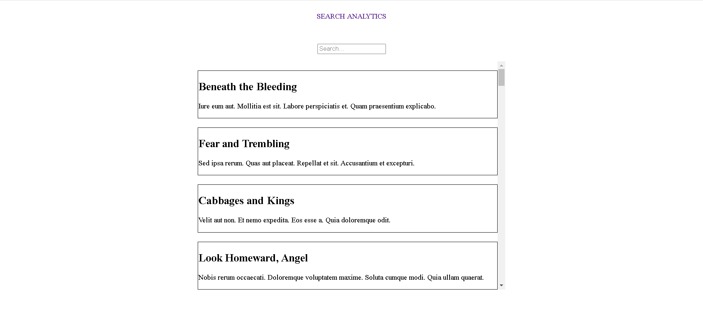

# Custom-Search

Custom-Search application in which the search box is linked to SEO and it displays web statistics so that the user can see the most frequently searched articles and other data. A session is given per user at the start of running the site, and it will expire once you leave it.

## Screenshot

</>

## Built With

- Ruby on Rails
- PostgreSQL
- PG_Search
- VanillaJS
- CSS

## Getting Started

To get a local copy up and running follow these simple example steps.

### Prerequisites

- Laptop or Desktop
- Web Browser
- Ruby (installed and set up)
- IDE (preferably Visual Studio Code)
- Basic Programming Knowledge

### Installation, Setup and Usage

- **Clone this [repo](https://github.com/SaidRasinlic/Custom-Search)**
- Navigate to the correct directory **cd Budget-app** (case sensitive)
- Run **bundle install** in your terminal (in case you need to update the gems run **bundle update**)
- Run **yarn install**
- Setup database configuration in config/database.yml and use your correct username and password to access PostgreSQL database
- In your terminal run the following three commands:
  - `rails db:create`
  - `rails db:migrate`
  - `rails db:seed`
  - (Chain them all together: **rails db:create db:migrate db:seed**)
- Run **rails s** in your terminal to start the server.
- Enter **http://localhost:3000/ or localhost:3000** on your browser to view page
- **Congratulations! App should run successfully.**
- _ERROR ISSUES:_ If you get error due to PG_SEARCH, you have to install pg extension in database, navigate to databse and copy-paste this; `CREATE EXTENSION pg_trgm;`. This should fix the error!

## Author

👤 **Said Rasinlic**

- GitHub: [@GitHub/SaidRasinlic](https://github.com/SaidRasinlic)
- Twitter: [@Twitter/SaidRasinlic](https://twitter.com/SaidRasinlic)
- LinkedIn: [@LinkedIn/SaidRasinlic](https://www.linkedin.com/in/SaidRasinlic)

## 🤝 Contributing

Contributions, issues, and feature requests are welcome!

Feel free to check the [issues page](../../issues/).

## Show your support

Give a ⭐️ if you like this project!

## Acknowledgments

- Microverse 

## 📝 License

This project is [MIT](LICENSE) licensed.
